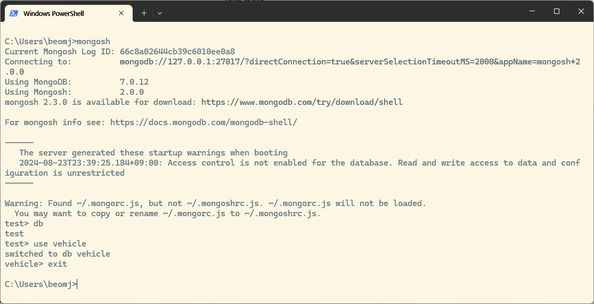

# Local에 몽고디비 설치 후 사용

## 몽고디비 설치 파일 다운로드 
- https://www.mongodb.com
- SOLUTIONS > Download Center > 윈도우용 설치파일 다운로드
- https://www.mongodb.com/try/download/community

### 학습: https://www.w3schools.com/mongodb/index.php

### 주의: 이 실습에서는 Compas GUI는 설치 하지 않습니다. 
- 몽고디비 6이상을 설치 했다면 MongoDB Shell을 별도로 설치해서 CLI 환경에서 사용해야 합니다. 


- MongoDB 커뮤니티 버전을 설치 후 MongoDB Shell을 별도로 설치 하고 CMD에 mongosh 입력.
- 몽고디비 접속 포트는 27017
- 구 버전의 CLI 에서 실습 하기 위해서는 mongo.exe 별도 다운로드 받아서 bin에 저장 후 사용.
- 구 버전의 CLI 에서는 몽고디비 데몬 실행 확인 후 CMD에서 mongo 실행
(6이상에서는 mongo.exe를 별도로 다운로드 하거나 MongoDB Shell 사용)

# Node.js에서 MongoDB 사용
- mongojs 모듈
- mongodb 모듈

## MongoDB 7.x Current 버전
- mongodb 모듈 5이상 버전에서는 콜백함수 대신 async ~ await 사용

``` javascript
const { MongoClient } = require("mongodb");
const uri = "mongodb://127.0.0.1";
const client = new MongoClient(uri);

async function run() {
  try {
    // Connect the client to the server (optional starting in v4.7)
    await client.connect();
    // Establish and verify connection
    const db = client.db("vehicle");
    const car = db.collection("car");
    const cursor = car.find({}, { projection: { _id: 0 } });
    await cursor.forEach(console.log);
    console.log("Connected successfully to server");
  } finally {
    // Ensures that the client will close when you finish/error
    await client.close();
  }
}
run().catch(console.dir);

```